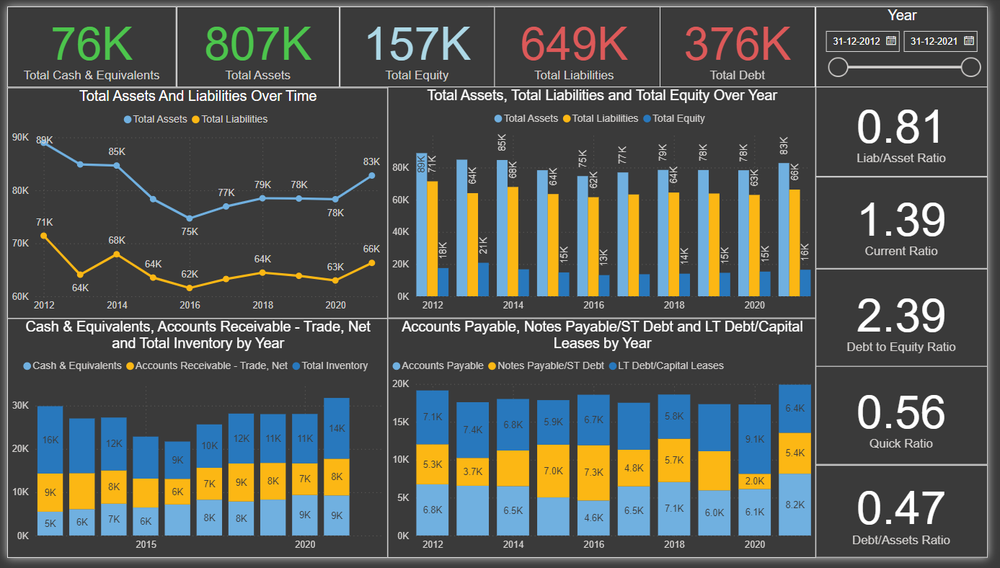

# Financial Performance and Ratio Analysis Dashboard

## Project Overview
This interactive dashboard provides a comprehensive analysis of Apple Inc.'s financial performance from 2012 to 2021. As an aspiring data analyst, I developed this visualization to demonstrate my ability to analyze complex financial data and derive meaningful insights for business decision-making.

Data Source: [Apple's Historical Financials](https://www.kaggle.com/datasets/thedevastator/apple-s-historical-financials)

## Dashboard Components

### Key Financial Metrics (Cards)
- Total Cash & Equivalents: 76K
- Total Assets: 807K
- Total Equity: 157K
- Total Liabilities: 649K
- Total Debt: 376K

### Financial Ratios (Cards)
- Liabilities/Asset Ratio: 0.81
- Current Ratio: 1.39
- Debt to Equity Ratio: 2.39
- Quick Ratio: 0.56
- Debt/Assets Ratio: 0.47

### Interactive Time Slider
- Allows analysis from 31-12-2012 to 31-12-2021

### Visualizations

1. **Total Assets and Liabilities Over Time (Line Chart)**
   - Tracks the trends of total assets and total liabilities from 2012 to 2020
   - Insight: Both assets and liabilities show an overall increasing trend, with assets consistently higher

2. **Total Assets, Total Liabilities and Total Equity Over Year (Bar Chart)**
   - Compares the three key balance sheet components annually
   - Insight: The gap between assets and liabilities (representing equity) has been relatively stable

3. **Cash & Equivalents, Accounts Receivable - Trade, Net and Total Inventory by Year (Stacked Bar Chart)**
   - Breaks down key components of current assets
   - Insight: Cash & equivalents have increased significantly from 2015 to 2020

4. **Accounts Payable, Notes Payable/ST Debt and LT Debt/Capital Leases by Year (Stacked Bar Chart)**
   - Analyzes the composition of liabilities over time
   - Insight: Long-term debt has increased substantially since 2012

## Business Impact and Insights

1. **Liquidity Position:**
   - The current ratio of 1.39 indicates that Apple can comfortably cover its short-term obligations.
   - The quick ratio of 0.56 suggests that while Apple's liquidity is decent, it may rely somewhat on inventory for short-term solvency.

2. **Leverage and Capital Structure:**
   - The debt to equity ratio of 2.39 indicates that Apple is using significant leverage, which could amplify returns but also increases financial risk.
   - The debt/assets ratio of 0.47 suggests that less than half of Apple's assets are financed through debt, which is a relatively conservative position.

3. **Asset Utilization:**
   - The consistent growth in total assets over time indicates continuous expansion and investment in the business.

4. **Working Capital Management:**
   - The increasing trend in cash & equivalents from 2015 to 2020 suggests improved cash management or potentially a build-up of cash for future investments or uncertain economic conditions.

5. **Long-term Financial Strategy:**
   - The significant increase in long-term debt since 2012 could indicate a strategic decision to take advantage of low interest rates for capital investments or shareholder returns.

## Skills Demonstrated
- Financial data analysis and interpretation
- Dashboard design and data visualization using Excel and Power BI
- Time series analysis of financial metrics
- Calculation and interpretation of key financial ratios
- Deriving business insights from financial statements

## About the Creator  
Rishav Singh Rajput - Aspiring Data Analyst  
Email - rishavsrajput@gmail.com  
LinkedIn Profile - [www.linkedin.com/in/rishav-rajput](https://www.linkedin.com/in/rishav-rajput)

I'm passionate about translating financial data into actionable business insights. I'm actively seeking opportunities in financial analysis and data analytics. Feel free to reach out to discuss this project or potential collaborations!
